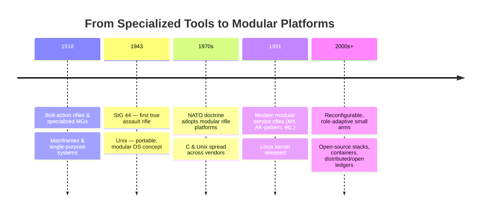
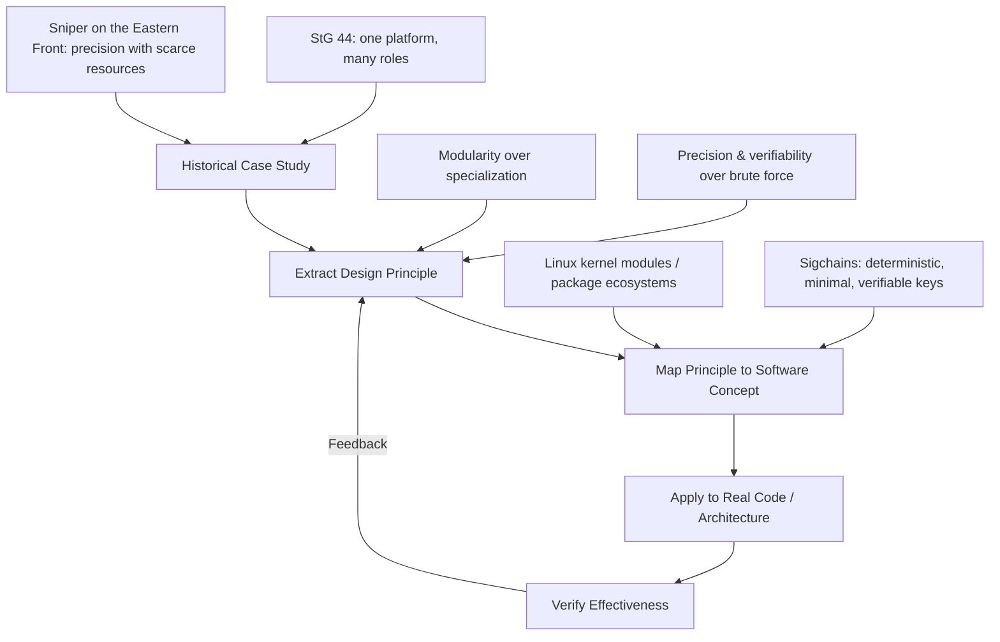
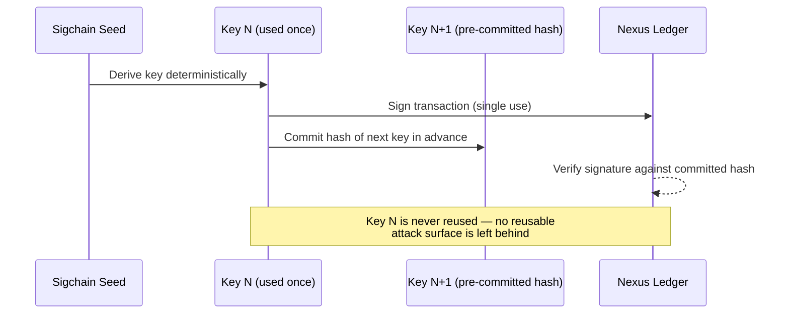
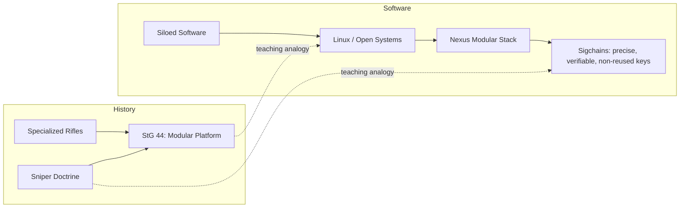

# A Historical Philosophy of Coding: From the Sturmgewehr to Open Systems

> **Note on framing:** This document uses historical military technology as a
> *teaching metaphor* for the evolution of software architecture. It does
> **not** describe Nexus Sigchains as a stealth, anonymity, or evasion
> technology. Sigchains are a deterministic, cryptographically verifiable
> signature-chain system. Where the metaphor says "leaves without a trace,"
> read it as *"leaves no ambiguity about authenticity and no wasted,
> vulnerable key material,"* not "cannot be seen." See the caveat in
> Section 4.

## 1. Core Thesis

> Just as the Sturmgewehr represented a shift from specialized, purpose-built
> rifles to a modular, adaptable platform (the "assault rifle" concept),
> open-source/Linux systems represent a similar shift from siloed,
> purpose-built software to modular, adaptable, interoperable platforms.

Before the Sturmgewehr (StG 44), infantry doctrine relied on separate,
specialized tools: the long-range bolt-action rifle, the short-range
submachine gun, the crew-served automatic weapon. Each excelled narrowly and
failed outside its niche.

Before Unix/Linux and open standards, software followed the same pattern:
vertically-integrated, vendor-locked systems built for one machine, one
purpose, unable to interoperate without custom, brittle bridges.

The StG44 fused intermediate-cartridge ballistics, select-fire control, and a
modular receiver into **one adaptable platform** usable across roles. Linux
and the open-source stack did the same for computing: a modular kernel,
composable userland tools, and open interfaces that let one system flex
across servers, desktops, embedded devices, and now blockchain nodes.

## 2. Teaching Framework: History as a Debugging Tool for Intuition

Historical analogy is a pedagogical device, not a literal equivalence. The
goal is to give learners a **physical, visualizable model** for abstract
architecture decisions.

## 3. Sniper-Format Correlation Table

Framed like a reconnaissance/marksmanship briefing — traits of the platform
mapped directly to traits of the open system.

| Sturmgewehr / Sniper Trait | Description | Open-System / Linux Correlate | Effectiveness Check |
|---|---|---|---|
| **Modular receiver** | One chassis, swappable roles | Modular Linux kernel & packages | Can the system be reconfigured without a rebuild from scratch? |
| **Intermediate cartridge** | Balanced power vs. control | Balanced abstraction layers (not too low-level, not too bloated) | Does the API/tooling scale from embedded to server without rewrite? |
| **Select-fire control** | Operator chooses mode per situation | Configurable runtime/build flags, feature modules | Can behavior be tuned without forking the codebase? |
| **Sniper: precision over volume** | One well-placed shot vs. suppressive fire | Deterministic, auditable logic over brute-force patching | Is the fix root-cause, or just noise-suppression? |
| **Reconnaissance: minimal footprint** | Move without disturbing the environment | Idempotent operations, no orphaned state/side effects | Does re-running the process leave duplicate or dangling artifacts? |
| **Field-adaptability** | Same weapon, many terrains | Cross-platform builds (desktop/mobile/embedded) | Does the same core logic run unmodified across targets? |

## 4. Nexus Sigchains — The Analogy Applied (with caveats)

**What a Sigchain actually is:** a deterministic chain of one-time-use
signature keys, generated from a seed via a defined hashing sequence, where
each key is used exactly once and the next key's hash is committed to in
advance. This gives forward-verifiable authenticity without ever reusing key
material.

Mapped to the sniper/reconnaissance metaphor **as a teaching device only**:

| Metaphor Element | Literal Meaning (Do Not Confuse) |
|---|---|
| "Quantum recon, leaving without a trace" | **Metaphor for:** no reused key material, no ambiguous or forgeable signature trail. **Not:** anonymity, invisibility, or untraceable transactions. Sigchain activity is fully on-ledger and verifiable. |
| "Precision shot" | **Metaphor for:** a single deterministic, verifiable signature per key, rather than repeated/relaxed validation. |
| "Adaptable platform" | **Metaphor for:** the same Sigchain mechanism underpinning wallets, identities, and assets across the Nexus stack, similar to one modular weapon platform serving multiple infantry roles. |

**Effectiveness verification**, in engineering terms — not metaphor:

- No key reuse across signatures (verifiable in code/tests).
- Each next-key hash commitment is checked before acceptance.
- Behavior is reproducible and auditable — the opposite of "untraceable";
  it is precisely *fully traceable, but never forgeable or reused.*

## 5. Historical Reference: *Sniper on the Eastern Front*

Josef "Sepp" Allerberger's biography (as told to Albrecht Wacker),
*Sniper on the Eastern Front: The Memoirs of Sepp Allerberger, Knight's Cross*,
is used here purely as a **case study in doctrine under resource
constraint**: precision, patience, and adaptability substituting for
overwhelming force. The pedagogical takeaway for engineers is:

- Favor a correct, minimal, verifiable fix (the "one shot") over sweeping,
  unverified changes ("suppressive fire").
- Adapt tooling to the terrain (target platform) rather than forcing one
  rigid tool everywhere.

This reference is historical and biographical in nature and is included
strictly for the design-principle analogy above — not as commentary on the
conflict itself.

## 6. Summary Diagram

---

*This document lives in `docs/` alongside `Documentation.md`,
`Linux-FAQ.md`, and `Tritium_Upgrade_FAQ.md` as part of the project's
Documents section, intended for onboarding and conceptual teaching rather
than technical specification.*
