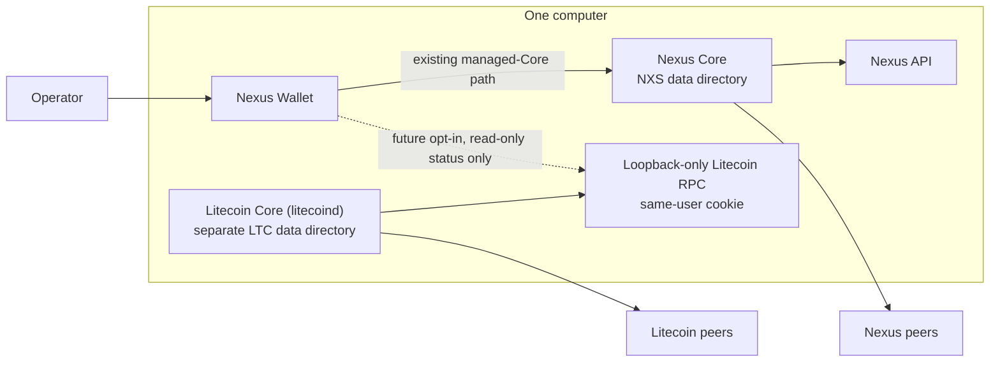
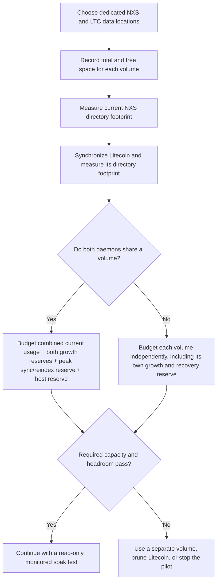
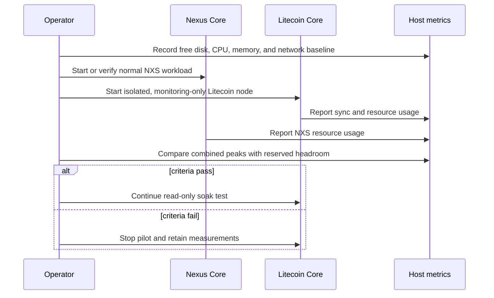
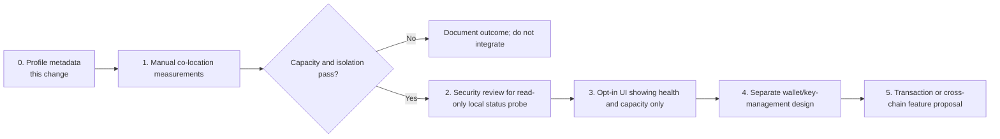

# Litecoin Co-Location Pilot

## Status

**Proposal and manual-test guide.** Litecoin is the preferred first external
chain candidate for a constrained-host pilot alongside Nexus (NXS). This
document defines a safe way to measure that feasibility before adding Litecoin
wallet, transaction, swap, bridge, or automatic daemon-management features to
Nexus Wallet.

The pilot deliberately does **not** make a claim that Bitcoin is generally
infeasible. It simply preserves the stated local constraint: Bitcoin's
blockchain footprint and transaction-fee economics are not suitable for the
initial test computer. Storage and host-resource feasibility are independent
from transaction-fee economics and must be evaluated separately.

## Goals

- Determine whether Nexus Core and Litecoin Core can run on one computer
  without exhausting disk, memory, CPU, or network capacity.
- Measure Litecoin on the actual target version and hardware instead of relying
  on a static blockchain-size estimate.
- Keep the two daemons, their data, their credentials, and their failure modes
  isolated.
- Establish a read-only integration path that can be considered only after the
  manual pilot passes.

## Non-goals

This work does not:

- bundle, download, launch, stop, or configure `litecoind`;
- manage Litecoin keys, wallets, addresses, transactions, or backups;
- store or transmit Litecoin RPC credentials;
- implement a swap, bridge, exchange, or cross-chain transfer;
- expose Litecoin RPC outside the local machine; or
- imply that Litecoin is a supported Nexus Wallet feature yet.

## Current Boundary

Nexus Wallet currently manages Nexus Core and has an existing configurable
Nexus Core data directory. Litecoin must remain an independently installed and
operated process during this pilot. The accompanying
[`externalChains.ts`](../src/shared/data/externalChains.ts) file records
non-secret Litecoin metadata for future work, but it is explicitly marked as a
research-only profile and does not enable runtime behavior.



The dotted connection is a future boundary, not an implemented one. A later
implementation must not gain daemon control, wallet access, or credential
access merely to show node health.

## Isolation Requirements

| Concern | Pilot requirement |
| --- | --- |
| Data directory | Use an explicit Litecoin `-datadir` that is different from the Nexus Core data directory. Never share data, blocks, configuration, or wallet files. |
| Filesystem capacity | Put Litecoin on a separately budgeted volume, quota, or directory. `-blocksdir` can isolate block files further when appropriate. |
| Process identity | Prefer a dedicated OS service account for Litecoin. Do not run it as, or grant it access to, the Nexus Core service identity. |
| Network ports | Keep Litecoin's P2P and RPC ports distinct from Nexus. Litecoin's normal mainnet ports are P2P `9333` and RPC `9332`. |
| RPC access | Keep RPC loopback-only. Use the same-user cookie for a local client; do not copy the cookie into Nexus Wallet or expose it through renderer code. |
| Wallet material | Start a monitoring-only node with `-disablewallet=1`. Do not remove that protection until a separate wallet-security design has been approved. |
| Logging and backups | Keep paths and retention policies separate so one daemon cannot consume the other daemon's capacity. |

## Resource Feasibility

Do not put a fixed full-node size in code or documentation. Blockchain data,
indexes, logs, chainstate, the configured software version, and future chain
growth all affect the result.

`litecoin-cli getblockchaininfo` is useful during the pilot, but its
`size_on_disk` field estimates block and undo-file storage only. It is not the
entire Litecoin data-directory footprint. Measure both the RPC value and the
actual directory or filesystem.



### Required Measurements

Record the following before the first Litecoin sync, after synchronization, and
after a sustained co-location test:

| Measure | Example command or source | Why it matters |
| --- | --- | --- |
| Litecoin block and undo estimate | `litecoin-cli getblockchaininfo` | Captures `size_on_disk`, sync state, and pruning state. |
| Litecoin full data-directory footprint | `du -sh "$LTC_DATA_DIR"` | Includes chainstate, indexes, logs, and other files omitted from `size_on_disk`. |
| Nexus data-directory footprint | `du -sh "$NXS_DATA_DIR"` | Establishes the actual NXS baseline on the same machine. |
| Free capacity | `df -h "$LTC_DATA_DIR" "$NXS_DATA_DIR"` | Detects insufficient headroom on either volume. |
| Memory and CPU peak | Platform task monitor or service metrics | Detects contention during initial sync, reindexing, and normal operation. |
| Network activity and peers | `litecoin-cli getnetworkinfo` and `litecoin-cli getpeerinfo` | Detects peer pressure and bandwidth use. |
| Mempool and locked memory | `litecoin-cli getmempoolinfo` and `litecoin-cli getmemoryinfo` | Records workload-related memory use. |

For a shared volume, the capacity decision must cover:

```text
NXS observed footprint
+ LTC observed footprint
+ NXS growth reserve
+ LTC growth reserve
+ peak initial-sync / reindex / recovery reserve
+ operating-system and application reserve
<= volume capacity
```

For the pilot to remain safe, the currently free capacity must also cover the
remaining expected sync and recovery headroom. Stop the test before that
headroom is depleted; do not treat a nearly full filesystem as a successful
result.

### Pruning Decision

Litecoin Core supports `-prune=<MiB>` with a minimum target of 550 MiB. Pruning
may make a constrained-host pilot feasible, but it is not a free substitute for
capacity planning:

- pruning is incompatible with `-txindex`;
- wallet rescans need historical data and are constrained by pruning; and
- switching back to an unpruned node requires downloading the full chain again.

Use an unpruned node only when the later use case truly needs historical data.
Otherwise, compare a pruned monitoring-only pilot with the required service
capabilities before making a product decision.

## Pilot Procedure

1. Install Litecoin Core independently of Nexus Wallet and verify its release
   according to the upstream project's instructions.
2. Select a dedicated, absolute Litecoin data directory. Record the selected
   volume's total and free capacity before starting the daemon.
3. Run Litecoin Core as a separate service identity where the operating system
   supports it. Keep its RPC listener on loopback and use cookie
   authentication for any local diagnostic client.
4. Start in monitoring-only mode with `-disablewallet=1`. Do not configure
   `rpcallowip`, a public `rpcbind`, or an RPC password in this repository.
5. Measure the NXS baseline, Litecoin synchronization behavior, and
   post-synchronization footprint using the table above.
6. Run a soak test while performing the normal NXS activities relevant to this
   host, including the user's intended staking or Lite-mode workload.
7. Stop or roll back the pilot if disk headroom, host responsiveness, NXS
   synchronization, or service isolation fails the acceptance criteria.



## Acceptance Criteria

The manual pilot may advance to a read-only integration design only when all of
the following are true:

- Nexus Core remains functional for its intended workload throughout the soak
  test.
- Litecoin and Nexus use distinct data directories, ports, process identities,
  and credential material.
- Both filesystem budgets retain the previously agreed recovery and operating
  system reserve after synchronization and normal use.
- No unexpected process restarts, data corruption, port conflicts, or
  prolonged host unresponsiveness occur.
- Litecoin RPC remains local-only, and no Litecoin credential is placed in
  application settings, logs, source control, or renderer-accessible data.
- The test record identifies the Litecoin Core version, NXS version, operating
  system, hardware, selected modes, and measured peaks.

## Follow-up Implementation Gates



Each gate is independent. Passing a storage test does not authorize wallet
support, transaction signing, daemon management, or any cross-chain feature.

## Initial Code Inroad

`src/shared/data/externalChains.ts` introduces one typed, non-operative
research profile for Litecoin. It records:

- the candidate identifier, display name, ticker, and daemon/CLI names;
- normal mainnet P2P and RPC ports;
- upstream default data-directory locations; and
- explicit booleans showing that the wallet does not manage the daemon, handle
  credentials, or handle Litecoin wallet material.

The profile is intentionally small and has no network, filesystem, process, or
credential behavior. A future implementation must remain opt-in and add
validated main-process IPC before it can use this metadata for a read-only
status probe.

## Authoritative References

- [Litecoin Core data-directory implementation](https://github.com/litecoin-project/litecoin/blob/master/src/util/system.cpp)
- [Litecoind manual: data directories, ports, pruning, RPC, and `-disablewallet`](https://github.com/litecoin-project/litecoin/blob/master/doc/man/litecoind.1)
- [Litecoin configuration example: RPC allowlists and authentication](https://github.com/litecoin-project/litecoin/blob/master/share/examples/litecoin.conf)
- [Litecoin RPC implementation of `getblockchaininfo`](https://github.com/litecoin-project/litecoin/blob/master/src/rpc/blockchain.cpp)
