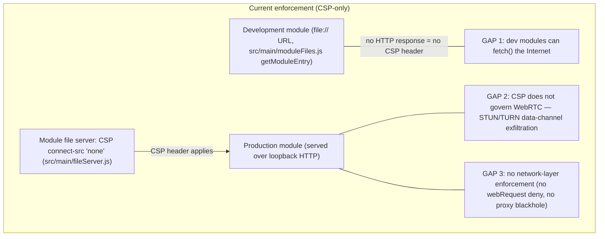
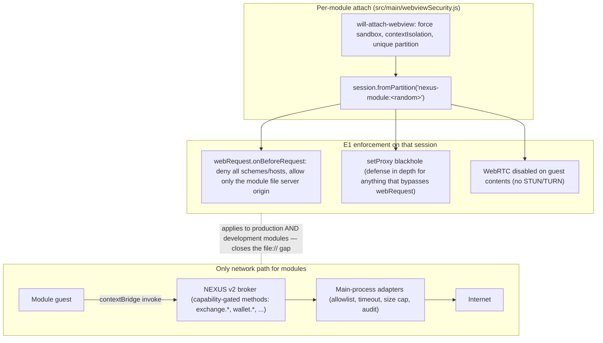

# Module egress enforcement — D3 = E3 policy, E1 mechanism

Decision context: [README §1 D3](../README.md#1-decision-record). Policy: modules never get direct Internet egress, even with capabilities (E3); all networking goes through the main-process broker. Mechanism: per-partition session-level deny-all (E1) so the guarantee is enforced at the network layer, not just by CSP headers.

## 1. Status quo (E2) and its gaps

Enforcement today is a CSP header (`connect-src 'none'`) set by the module file server (`src/main/fileServer.js`).

## 2. Target design (E1 mechanism enforcing E3 policy)

`src/main/webviewSecurity.js` already assigns each module webview a unique partition (`nexus-module:<random>`) in `will-attach-webview`, and resolves it to a `session` for policy bookkeeping. That session is the enforcement point.

## 3. Properties

| Property | How E1+E3 delivers it |
|---|---|
| Dev/prod parity | Enforcement keys off the session partition assigned at attach, not off how the entry was served — the `file://` dev gap closes. |
| WebRTC exfiltration closed | WebRTC disabled on guest contents; STUN/TURN never leaves the machine. |
| CSP demoted to defense-in-depth | The header stays, but the security claim rests on the network layer. |
| Capability model stays honest | Capabilities grant broker methods only. There is no "egress capability" — a future allowlisted-egress idea would reuse the same session hook, but E3 says we don't. |
| Upstream story | Small, self-contained security PR; strengthens the exact "modules can't reach the Internet" claim the isolation stack advertises. See [ROADMAP Phase 2](../ROADMAP.md#phase-2--egress-enforcement-e1). |

## 4. Related fixes bundled with this work

- **B2:** one-shot `authorizedEntries.delete` at attach denies legitimate `<webview>` re-attach after DOM reparenting (Electron re-creates guest WebContents) — authorization must tolerate re-attach.
- **B3:** `pendingPoliciesBySession` entry leaks when `will-attach-webview` fires but the guest's `web-contents-created` never does.
